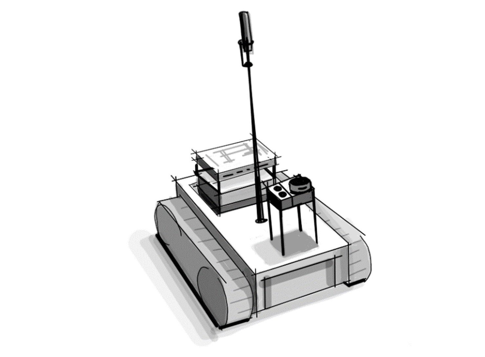

# Acoubot Project

## A Technical Compendium on Acoustic Optimization in Educational Environments

This repository is the home of the Acoubot project, a comprehensive Bachelor of Science endeavor dedicated to enhancing the acoustic quality of classrooms through advanced robotics and sound engineering. Detailed insights into the project's facets are accessible through the [Acoubot Project Book](https://alex-winner.github.io/Acoubot/).

[Youtube channel](https://youtube.com/playlist?list=PLzhG3b3_v2r4OEy7i6Xh99i17cTllAEFE&si=7O4T2HUXNfkJcdq2)

## Project Overview
Acoubot is an autonomous robotic system engineered to evaluate and improve classroom acoustics. This initiative is an amalgamation of theoretical knowledge and practical engineering, addressing real-world issues that hinder effective teaching and learning due to subpar acoustic conditions. The project encapsulates a full spectrum of technical exploration, from acoustic theory to robotics and sensor technology, resulting in a solution that offers both analysis and actionable recommendations for acoustic enhancements.

## Technical Scope

The project spans various domains, including:

* Acoustic Measurement: Utilizing an array of sensors to assess reverberation time, background noise levels, and sound insulation between rooms.
* Robotics Engineering: Featuring a mobile unit with LIDAR and ultrasonic sensors, and a Raspberry Pi 4b controller, all integrated within a 3D-printed robot body.
* Software Development: From sensor reading and signal processing to navigation and user interface design, all tailored to optimize the acoustic environment.

## Content Highlights

The project is comprehensively documented, covering:

* System Overview: Outlining the purpose, scope, and definitions.
* Theoretical and Technological Background: Surveying problems and solutions from both theoretical and technological standpoints, including discussions on sensors, actuators, and embedded systems.
* Functionality Specifications: Detailing the macro system diagram and the interplay between mobile and stationary units.
* Hardware and Software Architecture: Explaining the block diagrams, controller specifications, and algorithmic improvements.
* Design and Validation: Showcasing the 3D design of the robot and the extensive testing program.
* Operating Instructions and Summary: Providing guidance for users and a recapitulation of the project's achievements.

## Engagement and Collaboration

We invite students, educators, researchers, and enthusiasts in the fields of acoustics, robotics, and educational technology to explore our project. Your contributions can help refine the Acoubot system and extend its impact on educational settings globally.

For a more detailed exposition of the Acoubot system, please navigate through the contents of the [project book](https://alex-winner.github.io/Acoubot/).

## Contents of Project Book
1. [Abstract](https://alex-winner.github.io/Acoubot/#1-abstract)
2. [Introduction](https://alex-winner.github.io/Acoubot/#2-introduction)
3.	[Functionality specification](https://alex-winner.github.io/Acoubot/#3-functionality-specification)
4.	[Macro diagram of the system](https://alex-winner.github.io/Acoubot/#4-macro-diagram-of-the-system)
5.	[Hardware](https://alex-winner.github.io/Acoubot/#5-hardware)
6.	[Software](https://alex-winner.github.io/Acoubot/#6-software)
7.	[Design](https://alex-winner.github.io/Acoubot/#7-design)
8.	[Validation - the testing program](https://alex-winner.github.io/Acoubot/#8-validation---testing-program)
9.	[Product Operating Instructions](https://alex-winner.github.io/Acoubot/#9-product-operating-instructions)	
10.	[Summary](https://alex-winner.github.io/Acoubot/#10-summary)
11.	[Bibliography](https://alex-winner.github.io/Acoubot/#11-bibliography)	
12.	[Appendix](https://alex-winner.github.io/Acoubot/#12-appendix)