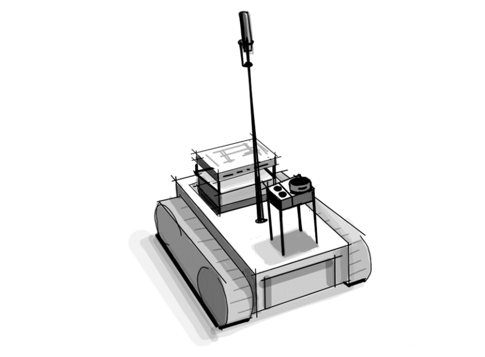
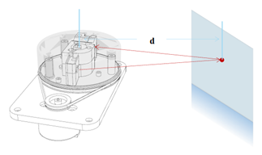
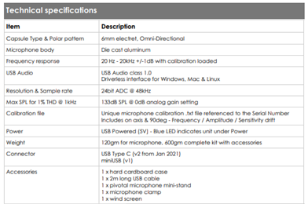
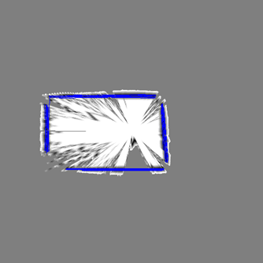
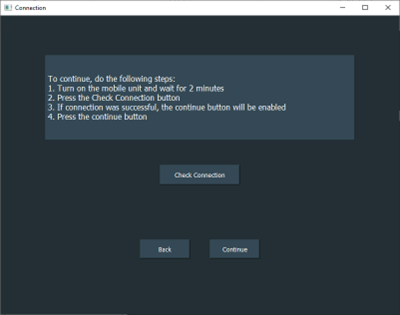
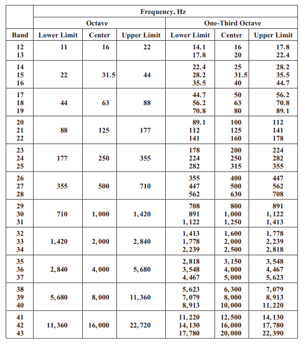

<style>
    h1 {letter-spacing: 3px;}
    h2 {letter-spacing: 2px;}
    h4  {
        font-weight: 700;
        padding-bottom: 5px;
        padding-left: 0px;
        margin:0;
        letter-spacing: 1px;
    }
    a {letter-spacing: 1px; line-height: 150%;}
    
    img[alt=center] { 
        display: block;
        background-color: white;
        margin-left: auto;
        margin-right: auto;
        max-width: 50%;
        }

    img[alt=center-big] { 
        display: block;
        background-color: white;
        margin-left: auto;
        margin-right: auto;
        }

    .red {
        color: red;
    }

    .blue {
        color: blue;
    }

    .green {
        color: green;
    }

    .table_validation tr:nth-child(9) {
        color: green;
        font-weight: 600;
    }

</style>

<!-- MathJax -->
<script type="text/javascript" src="https://cdnjs.cloudflare.com/ajax/libs/mathjax/2.7.3/MathJax.js?config=TeX-AMS-MML_HTMLorMML">
</script>

# Acoubot


## Contents
1. [Abstract](#1-abstract)
2. [Introduction](#2-introduction)
    1. [System Overview](#system-overview)
    2. [Purpose](#purpose)
    3. [Scope](#scope)
        1. [Room shape](#room-shape)
        2. [Echo and Room dimensions](#echo-and-room-dimensions)
        3. [The classroom floor](#the-classroom-floor)
        4. [Acoustic measurements (Reverberation time)](#acoustic-measurements-reverberation-time)
        5. [Acoustic measurements (Background noise)](#acoustic-measurements-background-noise)
        6. [Sound insulation between rooms](#sound-insulation-between-rooms)
        7. [Dimensions of the room](#dimensions-of-the-room)
    4.	[Definitions and Acronyms](#24-definitions-and-acronyms)
    5.	[Theoretical background](#theoretical-background)
        1.	[Theoretical Problem survey](#theoretical-problem-survey)
        2.	[Theoretical Solution Survey](#theoretical-solution-survey)
        3. [Discussion and Conclusion](#discussion-and-conclusion)
    6.	[Technological background](#technological-background)
        1.	[Technological Problem Survey](#technological-problem-survey)
        2.	[Technological Solution Survey](#technological-solution-survey)
        3.	[Sensors](#sensors)
        4.	[Actuators](#actuators)
        5.	[Motor shield HAT](#motor-shield-hat)
        6.	[Communication](#communication)
        7.	[Embedded device](#embedded-device)
        8.	[Language](#language)
3.	[Functionality specification](#3-functionality-specification)
4.	[Macro diagram of the system](#4-macro-diagram-of-the-system)
    1.	[Whole system](#whole-system)
    2.	[Mobile unit](#mobile-unit)
        1.	[Diagram](#diagram)
        2.	[Electric circuit](#electric-circuit)
    3.	[Stationary unit](#stationary-unit)
5.	[Hardware](#5-hardware)
    1.	[Block diagram](#block-diagram)
    2.	[Controller - Raspberry Pi 4b](#controller---raspberry-pi-4b)
    3.	[Sensors](#sensors)
        1.	[LIDAR](#lidar)
        2.	[Ultrasonic](#ultrasonic)
        3.	[UMIK-1 microphone](#umik-1-microphone)
    4.	[Actuators](#actuators-1)
        1.	 [DC motors](#dc-motors)
        2.	[Motor shield module](#motor-shield-module)
    5.	[Energy](#energy)
        1.	[Uninterruptible Power Supply (UPS) module](#uninterruptible-power-supply-ups-module)
        2.	[Motor Power supply - Vs](#motor-power-supply---vs)
    6.	[Portable mini-Router](#portable-mini-router)
6.	[Software](#6-software)
    1.	[Background](#background)
    2.	[Software improvement](#software-improvement)
    3.	[Sensor reading](#sensor-reading)
        1.	[Microphone](#microphone)
        2.	[Lidar](#lidar)
        3.	[Ultrasonic](#ultrasonic)
    4.	[Signal processing](#signal-processing)
        1.	[Audio analyzer module](#audio-analyzer-module)
    5.	[Problem to an acoustic treatment solution conversion](#conver)
    6.	[Navigation](#navigation)
        1.	[Background](#background-1)
        2.	[Measurement process](#measur)
        3.	[Scanning](#scanning)
        4.	[Computer vision algorithms](#computer-vision-algorithms)
        5.	[Navigation (Drive)](#navigation-drive)
    7.	[Communication](#communication-1)
    8.	[User Interface](#user-interface)
7.	[Design](#7-design)
    1.	[Robot body – 3d printed model](#robot-body-–-3d-printed-model)
        1.	[microphone and ultrasonic holder](#microphone-and-ultrasonic-holder)
        2.	[microphone body mount](#microphone---body-mount)
    2.	[Robot body – Location of components](#robot-body-–-location-of-components)
    3.	[Project poster](#project-poster)
8.	[Validation - the testing program](#8-validation---testing-program)
    1. [Communication](#communication-2)
    2. [Sound record and analysis (Microphone sensor)](#sound-record-and-analysis-microphone-sensor)
    3. [Acoustic Solution](#acoustic-solution)
    4. [Mapping](#mapping)
    5. [Navigation](#navigation)
    6. [Hardware validation](#hardware-validation)
        1. [Battery (RPi and Motors)](#battery-rpi-and-motors)	
        2. [Load capacity](#load-capacity)
        3. [Heat endurance](#heat-endurance)
        4. [Microphone pole vibration](#microphone-pole-vibration)
9.	[Product Operating Instructions](#9-product-operating-instructions)	
10.	[Summary](#10-summary)
11.	[Bibliography](#11-bibliography)	
12.	[Appendix](#12-appendix)	
    1.	[POC](#poc)
    2.	[One-Third Octave band table](#one-third-octave-band-table)
    3.	[Validation plan - tables and additional data](#validation-plan---tables-and-additional-data)
        1.	[RT60](#rt60)
        2.	[dBSPL](#dbspl)
        3.	[reverberation time solution](#reverberation-time-solution)

## 1. Abstract

An Acoubot system serves to enhance speech intelligibility within classrooms. Numerous factors can impede students' concentration during lectures and their ability to grasp the taught material. One major contributing factor to this issue is the acoustic conditions within classrooms. Typically, classrooms do not conform to recommended acoustic standards. Consequently, students contend with various disturbances originating both externally, such as conversations in adjacent classrooms or hallway noise, and internally, often related to the classroom's geometry.

Our proposed solution to address acoustic issues in classrooms involves the use of a robot designed to assess its surrounding environment and conduct acoustic measurements. These measurements are then automatically analyzed, allowing users to visualize all acoustic problems within the room via a map. On this map, problematic areas are highlighted, accompanied by suggested solutions aimed at improving speech intelligibility.

## 2. Introduction	
### System Overview	

The Acoubot system is a user-friendly platform designed to enhance room acoustics without requiring any prior knowledge or expertise in the field. This innovative system automatically detects room parameters and provides users with detailed information regarding acoustic issues and potential solutions. The information is presented on an interactive room map, making it easy for users to understand and implement improvements.

The "AcouBot" system autonomously scans and measures the room, freeing users from the technical aspects of measurement. Instead, users can focus on making acoustic adjustments based on the system's recommendations and compare the results against predefined benchmarks. The system's primary objective is to optimize speech intelligibility, ensuring that the identified acoustic problems align with this specific acoustic profile.

### Purpose	
The Acoubot system serves two primary purposes:

1. **Enhancing Room Acoustics**: The system's foremost objective is to enhance the acoustics of a room without requiring the involvement of an acoustic professional.

2. **Automating Benchmarking**: The second purpose is to automate the entire benchmarking process, typically conducted manually by a professional. This automation empowers users to make room adjustments based on the robot's calculated recommendations, simplifying the process and reducing the need for specialized expertise.

### Scope	

In order to achieve project success, we will define clear objectives and delineate the project's boundaries by discussing what it does not encompass. Our project involves the development of automatic test equipment for acoustic measurements and the identification of solutions that can enhance speech intelligibility in classrooms. Within the vast realm of acoustics, we will specifically address the following aspects:

#### Room shape

The system is designed to work with rooms that have boxy shapes. Other room shapes would significantly complicate tasks such as navigation, map creation, acoustic problem-solving, and room dimension measurements.

#### Echo and Room dimensions

Echo, which occurs when the delay between the original sound and reflected sound is less than 1/10 of a second, will not be discussed in this project since it is not typical in classrooms. Additionally, room dimensions and their potential impact on echo will be considered insignificant. For instance, the echo effect begins to manifest when the diagonal length of a room exceeds 17.2 meters, and it becomes significant in rooms larger than 140 square meters.

#### The classroom floor

The classroom's floor must be flat and devoid of stairs due to the mechanical limitations of the robot.


#### Acoustic measurements (Reverberation time)

Reverberation time, a parameter influencing speech intelligibility, will be measured to evaluate the room's acoustic properties and determine the required amount of acoustic absorbers.

#### Acoustic measurements (Background noise)

Background noise levels, impacting speech intelligibility positively as signal-to-noise ratio (SNR) increases, will be measured at various points within the classroom. Noise sources will be identified, and steps to reduce noise levels will be recommended.

#### Sound insulation between rooms

Acoustic insulation between rooms will not be a focal point of the project. Testing sound insulation would require the robot to exit the classroom, potentially complicating navigation and communication.

#### Dimensions of the room

Measuring the room's dimensions is essential for understanding the behavior of sound waves within it. This information will be used for calculations related to practical acoustic solutions and robot navigation.

### Definitions and Acronyms

| Term        | Definition                                                                                                                                                                                                                                             |
|-------------|--------------------------------------------------------------------------------------------------------------------------------------------------------------------------------------------------------------------------------------------------------|
| RT_60       | Reverberation time, the decay time of a sound                                                                                                                                                                                                          |
| Echo        | Acoustic phenomena                                                                                                                                                                                                                                     |
| SI          | Speech intelligibility                                                                                                                                                                                                                                 |
| SNR         | Signal to Noise Ratio                                                                                                                                                                                                                                  |
| Reflection  | Direction change of a wavefront at an interface between two different media so that the wavefront returns into the medium from which it originated                                                                                                     |
| Refraction  | Refraction is the phenomenon of a wave changing its speed                                                                                                                                                                                              |
| Diffraction | A wave exhibits diffraction when it encounters an obstacle that bends the wave or spreads after emerging from an opening. Diffraction effects are more pronounced when the size of the obstacle or opening is comparable to the wavelength of the wave |
| MU          | Mobile Unit                                                                                                                                                                                                                                            |
| SU          | Stationary Unit                                                                                                                                                                                                                                        |
| MP          | Measurement Point                                                                                                                                                                                                                                      |
| SPI         | Speech Transmission Index                                                                                                                                                                                                                              |
| RPi         | Raspberry Pi controller                                                                                                                                                                                                                                |
| RF          | Radio Frequency                                                                                                                                                                                                                                        |
| GPIO        | General Purpose Input Output (RPI)                                                                                                                                                                                                                     |
| dBFS        | Decibels relative to full scale                                                                                                                                                                                                                        |
| ESS         | Exponential Sweep Sine                                                                                                                                                                                                                                 |


### Theoretical background
#### Theoretical Problem survey


According to academic research, a significant number of classrooms fall short of standard acoustic requirements. For instance, in 11 active Korean university classrooms, adult students experienced average speech levels of 51.5 dBA, noise levels of 44.3 dBA, and a speech-to-noise ratio of 7.2 dBA. Poor classroom acoustics have a direct adverse impact on speech intelligibility, particularly in university classrooms and labs, and even more so in younger schools.

In 2016, an assessment model (CAAM) categorized factors affecting speech intelligibility, extending beyond classroom acoustics to encompass lighting, proper ventilation (temperature-related, not noise-related), and teaching style. Among these parameters, it's evident that acoustics and noise have the most pronounced influence on speech intelligibility, as indicated by the chart below.


The ANSI S12.60 standard for classroom acoustics addresses both reverberation time and background noise and sets maximum permissible levels for each:

The maximum permitted reverberation time in an unoccupied, furnished classroom is 0.6 seconds for classrooms with a volume under 283 m³.
The maximum allowable background noise level is 35 dBA.

#### Theoretical Solution Survey

To address these issues and enhance speech intelligibility, we will concentrate on the frequency ranges relevant to human speech, particularly consonants, which contain vital articulation information. Our approach involves leveraging principles of Reflection, Refraction, and Diffraction.

We will isolate the acoustic problem by conducting measurements at multiple points within the room. We will follow the ISO 140 standard to measure noise sources when they are stationary and situated in the lecturer's position. This will enable us to assess the room's response to various frequencies and identify those that can impact speech intelligibility. Additionally, we will measure the decay time at different frequencies, determining the room's reverberation time. Using the Sabine Formula, we can calculate the necessary absorption to achieve the desired reverberation time. The placement of absorbers will be influenced by the room's shape, and we will analyze frequencies at which standing waves may form.

Background noise within the classroom will also be measured to identify common sources, such as air conditioner motors and external noise. Multiple measurements will be taken throughout the classroom to pinpoint the noise's location. Our approach combines various acoustic treatment methods to provide the most effective solution for improving speech intelligibility.

#### Discussion and Conclusion

During our investigation into classroom acoustics, we discovered numerous acoustic phenomena that can impact speech intelligibility. However, we excluded certain phenomena, such as echoing voices caused by hands-free communication, as they are not typical in classrooms due to their smaller size. Standard classroom dimensions are insufficient for these phenomena to manifest, so they were not investigated further.

### Technological background
#### Technological Problem Survey
The project faces several technical challenges that need to be addressed:

* **Automatic Acoustic Measurements:** One challenge is the automated execution of acoustic measurements at various points within the room. The issue here lies in determining how to select the appropriate measurement points in relation to the room's dimensions and size.

* **Data Analysis Accuracy:** Ensuring precise and reliable analysis of recorded data is crucial. This involves accurately measuring parameters like reverberation time and background noise across all relevant frequency bands. The problem is to devise effective methods for this analysis and to validate the results through a sanity test.

* **Room Mapping:** Mapping the room is essential for the algorithms that calculate acoustic solutions. To achieve this, we need accurate measurements of the room's dimensions, which presents its own set of challenges.

* **Robot Localization:** For the robot's navigation algorithm to function effectively, it must be able to identify its location within the room and determine its angle relative to the map's axes. This requires solutions for precise localization.

Addressing these technical challenges is critical to the successful execution of the project and the development of an efficient Acoubot system.

#### Technological Solution Survey
To address the technical challenges encountered in the project, several solutions and tools can be explored:

* **Hand-held XL2 Analyzer:** The Hand-held XL2 Analyzer is a versatile instrument that serves as a Sound Level Meter, a professional Acoustic Analyzer, a precision Audio Analyzer, and a comprehensive Vibration Meter all in one. It offers various analyzers, including capabilities for measuring RT60 (Reverberation Time), Speech Intelligibility STIPA (additional components may be required), and Noise curves. The data collected can be conveniently stored as a .txt file on an SD card, allowing for further analysis.


* **Bedrock Intelligibility Measurement Kit:** This kit comprises a Bedrock SM50 analyzer and a Bedrock BTB65 Talkbox Loudspeaker. It is specifically designed for conducting STIPA tests and measuring Noise levels (Pink and White). Notably, the kit plays back signals with automatically calibrated spectrum and levels, eliminating the need for user calibration.


* **REW (Room EQ Wizard):** REW is a free room acoustics analysis software that facilitates the measurement and analysis of room and loudspeaker responses. It provides tools for displaying equalizer responses and can automatically adjust parametric equalizer settings to counteract the effects of room modes, ensuring that responses align with a target curve.


These solutions offer valuable resources for addressing the technical challenges involved in the project, enabling accurate and efficient acoustic measurements, analysis, and room treatment recommendations.

#### Sensors

* **Microphone:** For acoustic measurements, we have opted for the miniDSP UMIK-1 measurement microphone. This microphone offers user-friendly operation and includes complimentary software for conducting measurements, decoding data, and comparing our algorithms. Specifically designed for acoustic testing, it connects via USB, making it exceptionally convenient when working with the Raspberry Pi (RPI). Moreover, it does not require any installations and is tailored for the LINUX operating system.

* **LIDAR:** 


#### Actuators
The stability of the robot frame is of paramount importance since it supports the microphone, creating an inverted pendulum effect. To enhance stability, we have chosen to use four DC electric wheel motors with a 1:48 gear ratio. These motors are well-suited for robotics and model vehicles, delivering a maximum torque of 800g/cm at a minimum voltage of 3V.

#### Motor shield HAT
To control the motors and manage them efficiently with high current requirements, we have selected a motor control controller compatible with the RPI. This ready-made module offers several advantages, eliminating the need for excessive wiring. The module connects directly above the controller and interfaces with all its GPIO BUS. Furthermore, it is designed to accommodate additional sensors, such as IR and ultrasonic sensors, with high voltage protections for GPIO connections.

#### Communication

Efficient communication is crucial for transmitting recording information, which can vary in size from tens to hundreds of megabytes. We considered several options, including Wi-Fi, Bluetooth, and RF networks. Given that the RPI already supports Wi-Fi and Bluetooth interfaces, we have chosen to utilize one of these options for convenience. The selection of Wi-Fi for transferring files is primarily based on the size of the data that needs to be transferred.

#### Embedded device

The embedded device faces certain constraints:

* Minimum sampling frequency must match the minimum sampling frequency of a sound wave, typically 44.1 kHz for reliable data recovery. In our case, the chosen microphone's sample rate is 48 kHz.
* Connectivity is critical as we will be connecting multiple sensors to the embedded device. The sensors include LIDAR, ultrasonic, and the microphone, each with specific interface requirements. The microphone and LIDAR interface via USB.
* The system must be capable of storing measurements, necessitating the connection of a memory card.

#### Language	

Python serves as the primary programming language for our project due to its compatibility with most modules used, including the RPI controller. It offers dedicated libraries for sensor data reading and control. Python is well-suited for both Linux and Windows environments, offering an abundance of online resources and examples. Python's flexibility is advantageous for algorithm development, testing, and debugging. While it may have slightly reduced speed compared to C++, it excels in ease of use and code readability. For tasks involving lengthy for loops, we prefer to use more efficient syntax or linear algebra methods.

## 3. Functionality specification

The Acoubot system is designed to perform various acoustic measurements and provide acoustic solutions for improving room acoustics. Here are the key functionalities and specifications of the system:

1. Room Measurement and Mapping:
    * The system measures the dimensions of the room and creates a map.
    * It determines where to take acoustic measurements based on the room map.

2. Acoustic Measurements:

    * The system calculates the reverberation time in the room.
    * It measures background noise levels.

3. Data Transfer:

    * All measurements, including acoustics and room dimensions, are transferred to a computer with a dedicated application for further analysis.

4. Acoustic Solutions:

    * The application provides acoustic solutions if necessary to enhance room acoustics.

5. Verification Measurements:

    * After implementing an acoustic solution, a second measurement can be performed for verification.

6. Room Shape:

    * The system is optimized for boxy-shaped rooms.
    * It prefers the angle between two nearby walls to be 90 degrees, but it can handle angles within ±5 degrees.

7. Room Size:

    * The system can handle rooms with a maximum size of 127 square meters (distance between two far corners of the room not exceeding 16 meters).

8. Ceiling Height:

    * The maximum height of the ceiling that the system can work with is 5 meters.

9. Compatibility:

    * The system is not compatible with rooms featuring glass doors or walls. These surfaces should be covered when using AcouBot.
10. Device Dimensions:

    * The device's dimensions are 23 cm in length, 13 cm in width, and 110 cm in height.

11. Weight:

    * The device weighs 1.8 kilograms.

12. Rechargeable Battery:

    * The system is equipped with a rechargeable battery.
    * UPS (Uninterruptible Power Supply) provides 2 hours of operation.
    * RC (Remote Control) battery offers 5 hours of usage time.

13. Usage Time:

    * The system can operate for approximately 4 hours on a single charge.

14. Wi-Fi:

    * The system utilizes a 2.4GHz Wi-Fi connection for data transfer and communication.

These specifications define the capabilities and limitations of the Acoubot system, ensuring it is well-suited for measuring and improving room acoustics within the specified parameters.

## 4. Macro diagram of the system
### Whole system


*Figure 4-1: Hardware architecture*

### Mobile unit	
#### Diagram 

*Figure 4-2: Mobile unit diagram*


Index | Interface  | Notes
------|------------|-------------------------------------------------
1     | USB        |
2     | Power, I2C | I2C for reading battery status, RPi power supply
3     | USB        |
4     | GPIO       |
5     | GPIO       |
6     | Power      | Motor high current power supply
7     | GPIO       | PWM
*Table 2: Mobile unit interfaces*


#### Electric circuit


*Figure 4-3: Mobile unit electric circuit*

### Stationary unit


*Figure 4-4: Stationary unit diagram*

Index | Interface       | Notes
------|-----------------|-------------------------
1     | Bluetooth/Wired | Test signal
2     | USB             | Communication with robot

*Table 3: Stationary unit interfaces*

## 5. Hardware
### Block diagram


*Figure 5-1: Full block diagram*

### Controller - Raspberry Pi 4b

The core of our mobile unit is the Raspberry Pi 4b. This versatile single-board computer serves as the central processing unit for our system, orchestrating the operation of sensors and actuators while also providing onboard Wi-Fi connectivity. With an embedded Python interpreter, the Raspberry Pi seamlessly integrates into our system's architecture. Here are some key details about the Raspberry Pi 4b:


*Figure 5-2:RPi model 4b*

* **CPU:** The Raspberry Pi 4b is powered by a Broadcom BCM2711 CPU. Its micro-architecture, ARM Cortex-A72, is commonly found in popular smartphone CPUs, ensuring robust performance.

* **RAM:** The Raspberry Pi 4b is equipped with 2 GB of RAM, providing sufficient memory for our system's computational needs.

* **General-Purpose Input-Output (GPIO):** The GPIO interface consists of a 40-pin pinout that allows us to connect various sensors and actuators, including LEDs and motors. These I/O pins are digital in nature, so analog sensors require Analog-to-Digital Conversion (ADC) for compatibility.

* **Modularity:** One of the standout features of the GPIO interface for our project is its support for modular components that can be easily attached, much like building blocks. These modules are pre-designed circuits equipped with libraries of code, enabling us to activate their specific features by implementing pre-made functions.

The Raspberry Pi 4b's combination of processing power, memory, GPIO flexibility, and modularity makes it an ideal choice for the core of our mobile unit, facilitating seamless integration and control of various sensors and actuators in our Acoubot system.


*Figure 5-4:GPIO*

### Sensors	
#### LIDAR



*Figure 5-5:Lidar work concept*

The selection of the LIDAR sensor, specifically the RPLIDAR, was driven by its capability to provide the Mobile Unit (MU) with essential functionalities, including self-localization for indoor navigation and the acquisition of room dimension data for acoustic measurements. 

Here are some key details about the RPLIDAR sensor:

* **Laser Triangulation Principle:** The RPLIDAR sensor is designed based on the laser triangulation principle. It employs a high-speed vision acquisition and processing hardware developed by SLAMTEC to precisely measure distances.

* **High-Speed Data Acquisition:** The RPLIDAR system is capable of measuring distance data at a rate exceeding 8000 times per second. This high-speed data acquisition ensures accurate and real-time distance measurements.

* **High-Resolution Output:** The sensor provides high-resolution distance output with an impressive level of precision, offering distance values with an accuracy of less than 1% of the measured distance.

* **Infrared Laser Emission:** RPLIDAR emits a modulated infrared laser signal, which is projected onto the objects in its vicinity. The laser signal is then reflected by these objects.

* **Vision Acquisition and Processing:** The vision acquisition system within the RPLIDAR samples the returning laser signal. The DSP (Digital Signal Processor) embedded in the RPLIDAR sensor processes this sampled data. The result is the output of distance values and angle values between the objects and the RPLIDAR sensor through a communication interface.

* **360-Degree Scanning:** To achieve comprehensive environmental awareness, the RPLIDAR sensor is mounted on a spinning rotator equipped with a built-in angular encoding system. During rotation, the sensor performs a 360-degree scan of the current environment.

Overall, the RPLIDAR sensor's ability to rapidly and accurately measure distances, combined with its 360-degree scanning capability, makes it an invaluable component in our Acoubot system, enabling self-localization and room dimension data acquisition for acoustic measurements.


*Figure 5-6: Lidar specification*

#### Ultrasonic


*Figure 5-7: Ultrasonic sensor*

The ultrasonic sensor serves a crucial role in detecting the height of the room as part of the room dimension data. Specifically, we use the HC-SR04 ultrasonic sensor, which relies on SONAR (Sound Navigation and Ranging) principles to accurately measure distances. Here are the key features and details of the HC-SR04 ultrasonic sensor:

* **Non-contact Range Detection:** The HC-SR04 ultrasonic sensor excels at non-contact range detection. It provides highly accurate and stable distance measurements without the need for physical contact with objects or surfaces.

* **Wide Measurement Range:** This sensor is capable of measuring distances ranging from 2 centimeters to 400 centimeters (approximately 1 inch to 13 feet). Its versatility makes it suitable for a wide range of applications.

* **Robust Performance:** The HC-SR04's operation remains unaffected by external factors such as sunlight or the color of objects. Unlike some other sensors, it can reliably operate in various lighting conditions, including outdoors.

* **Ultrasonic Transmitter and Receiver:** The sensor is equipped with both an ultrasonic transmitter and receiver module. These components play vital roles in its functionality.

* **Transducers:** On the front of the ultrasonic range finder, there are two metal cylinders known as transducers. Transducers are responsible for converting mechanical forces into electrical signals. In the case of the HC-SR04, there are two types of transducers: the transmitting transducer and the receiving transducer.

* **Transmitting Transducer:** The transmitting transducer converts an electrical signal into an ultrasonic pulse. This pulse is emitted into the environment and travels until it encounters an object.

* **Receiving Transducer:** The receiving transducer detects the reflected ultrasonic pulse when it returns after bouncing off an object. It converts this reflected pulse back into an electrical signal.

The HC-SR04 ultrasonic sensor's combination of accurate range detection, wide measurement range, and robust performance makes it an excellent choice for measuring room height in our Acoubot system. It plays a vital role in gathering essential room dimension data for our acoustic measurements.

#### UMIK-1 microphone



*Figure 5-8: Microphone specifications*

The UMIK-1 microphone is a crucial component for acoustic measurements in our project due to its specialized design for this purpose. Here are the key features and details about the UMIK-1 microphone:

* **Purpose-Built for Acoustic Measurement:** The UMIK-1 microphone is specifically designed for acoustic measurements, making it an ideal choice for our project's acoustic data collection needs.

* **Omni-Directional Pickup Pattern:** This microphone features an omni-directional (or nondirectional) pickup pattern. In ideal conditions, an omni-directional microphone captures sound evenly from all directions, forming a spherical response pattern in three dimensions.

* **Low Noise:** The UMIK-1 microphone is engineered to provide low noise, ensuring that the recorded acoustic data is clean and accurate.

* **Plug & Play:** It offers a plug-and-play setup, simplifying the integration of the microphone into our system without the need for complex configurations or driver installations.

* **Frequency-Dependent Polar Pattern:** While an omnidirectional microphone theoretically has a perfect spherical response, in reality, the microphone's body size can affect its polar pattern, especially at higher frequencies. The polar response may exhibit slight flattening due to the microphone's dimensions, which can impact sounds arriving from the rear. This effect becomes more pronounced as the diameter of the microphone approaches the wavelength of the specific frequency in question.

* **Miniature Diameter:** To mitigate the flattening of the polar response, smaller-diameter microphones are preferred for achieving the best omnidirectional characteristics, particularly at higher frequencies.

In summary, the UMIK-1 microphone's specialized design, omni-directional pickup pattern, low noise, and ease of use make it an excellent choice for acoustic measurements in our project. It ensures accurate and reliable data collection for assessing room acoustics and implementing acoustic solutions.

### Actuators
#### DC motors


In our system, we employ standard dual-shaft geared DC motors, utilizing a total of four motors with one dedicated to each wheel. Initially, we experimented with a robot design featuring tracks for smoother pivoting. However, this design proved to be high-maintenance. We subsequently transitioned to a wheel-based design, which still allowed for sufficiently smooth pivoting.

#### Motor shield module


The Motor Shield Module serves as a crucial component in our system, acting as an extension or "hat" for the Raspberry Pi. This module facilitates the control of up to four separate DC motors. It achieves this through the inclusion of two Dual H-bridge IC L293D chips, which function as the motor controllers. Each of these chips can independently control two separate motors.

#### H-Bridge Circuit:

To understand the functionality of the Motor Shield Module, it's essential to grasp the concept of an H-Bridge circuit. An H-Bridge circuit consists of four switches arranged in an "H" shape configuration, with the motor positioned at the center. This arrangement allows for the control of the motor's spinning direction by changing the polarity of its input voltage.


> *Here's how it works:*
>
> *Closing two specific switches simultaneously in the H-Bridge circuit reverses the polarity of the voltage applied to the motor, causing a change in the spinning direction of the motor.*
>
> *For example:*<br>
> *Closing switches S1 and S3 will turn the motor on in a particular direction.* <br>
> *Closing switches S4 and S2 will turn the motor on in the opposite direction.*


The Motor Shield Module effectively manages the operation of the DC motors in our system, providing the necessary control for movement and direction. This component plays a crucial role in ensuring the mobility and navigation of the Acoubot within the room.

### Energy

The power supply strategy for the mobile unit (MU) in the Acoubot system involves the management of two distinct power-consuming groups:

* **Group 1:** This group includes critical components like the Raspberry Pi, LIDAR, Ultrasonic sensor, microphone, and Motorshield HAT (excluding V_s, which powers the L293DD chip).

* **Group 2:** This group is responsible for powering the four motors that drive the wheels.

The power consumption for each component in Group 1 was calculated based on information available in their respective datasheets. However, since the microphone lacked power consumption details, an estimation was made by referring to datasheets of similar microphones within the same category.

To predict the usage time of the MU's power supply, Peukert's law was utilized. Peukert's law is an equation that relates the discharge time of a battery to its capacity, discharge current, and a constant known as the Peukert constant (k). In this case, a Peukert constant of 1 was assumed, indicating an ideal battery.

Here is the formula used for calculating usage time (t) with Peukert's law:


$$\Large t = H \cdot (\frac{C}{I})^k$$


Where:

$t$ - is the actual time to discharge the battery (in hours). <br>
$H$ - is the rated discharge time (in hours). <br>
$C$ - is the rated capacity at that discharge rate (in milliampere-hours). <br>
$I$ - is the actual discharge current (in milliamperes). <br>
$k$ - is the Peukert constant (dimensionless). <br>

With a Peukert constant of 1, the calculated usage time for the power supply was approximately 4 hours.

The power supply employs a battery with a capacity of 6700 milliampere-hours (mAh). The maximum current tolerance for the batteries is 6.8A under a 3.7V nominal voltage, which corresponds to a maximum power of 25 watts. However, the actual maximum power after DC-DC conversion is approximately 20-22.6 watts.

It is worth noting that the division of the power supply into two groups is primarily due to the power requirements of the motors, which can exceed the capacity of the primary power source. To address this, an additional battery with a voltage of 11.1V and a capacity of 6000mAh is employed to power the motors.

In summary, the power supply strategy for the Acoubot MU takes into account power consumption calculations, Peukert's law, and the use of separate batteries to ensure stable and reliable operation, even under demanding conditions.

device        | current[mA]
--------------|------------
RP            | 1200
lidar scanner | 300
lidar motor   | 100
mic           | 50
ultrasonic    | 15
motorshield   | 50
**total**     | **1715**


UPS capacity is 6700[mAh] so:

$$t = \frac{C}{I} = \frac{6700}{1715} ≅ 4[Hours]$$ 

The detailed explanation provided clarifies the power considerations for the Acoubot system's mobile unit (MU) and the use of separate batteries for different power-consuming groups. Here's a summary of the key points:

* **Battery Tolerance and Maximum Power:** The batteries used in the system can tolerate a maximum current of 6.8A under a 3.7V nominal voltage, resulting in a maximum power capacity of 25 watts.

* **Total Power Usage:** The combined power consumption of all components in the system, as indicated in the table, is approximately 8 watts.

* **DC-DC Conversion Efficiency:** The UPS employs 3.7V batteries that are converted to 5V. The conversion process is estimated to have an efficiency range of 80% to 90%. This results in an actual maximum power output of 20-22.6 watts.

* **Split Power Supply Groups:** The decision to divide the power supply into two groups is primarily driven by the power demands of the Motorshield's L293DD chip. The V_s supplied to the motors starts with 600mA to each motor, and at peak usage, it can exceed 1.2A. Since all four motors are activated when the MU moves, this chip places a substantial power demand on the system.

* **Minimal Power Usage:** The minimal power usage, considering all four motors running at 600mA each (4 motors x 600mA x 5V), in addition to the 8 watts consumed by the rest of the system, would be at least 20 watts. Such high power demand would potentially destabilize the system even under minimal stress.

* **Additional Battery for Motors:** To ensure stable operation under maximum stress, an 11.1V, 6000mAh battery is introduced to power the MU's motors independently. This battery configuration aligns with the project's objective of enabling the MU to move and function seamlessly under demanding conditions.

* **Usage Time Calculation:** The usage time of the additional TCB battery, which powers the motors, is estimated to be approximately 1.25 hours under continuous maximum stress. However, it's important to note that the motors are not continuously active, and the MU's movements are intermittent, which would extend the overall usage time.

$$\large
t = \frac{6000}{4800} ≅ 1.25 [Hours]
$$

This power management approach effectively addresses the varying power requirements of different components in the system and ensures stable and reliable operation under a range of conditions, including maximum stress scenarios.


#### Uninterruptible Power Supply (UPS) module

The UPS (Uninterruptible Power Supply) module in the Acoubot system plays a crucial role in providing stable power to all components of the mobile unit, except for the motors of the wheels. Here are some key details about the UPS module:

* **Power Supply Stability:** The UPS module ensures a consistent and uninterrupted power supply to all components of the mobile unit. This stable power supply is essential for the proper functioning of sensitive electronics and sensors.

* **Battery Capacity:** The UPS module is equipped with two lithium batteries with a combined capacity of 6700 milliampere-hours (mAh). This capacity allows the system to operate continuously for approximately four hours before requiring a recharge.

* **Recharge Port:** The module board of the UPS includes a USB Type-C port for recharging the batteries. This convenient port allows for easy recharging when the batteries are depleted.

* **Duration of Operation:** With a total battery capacity of 6700mAh, the UPS module can provide power to the mobile unit for up to four hours under normal operating conditions. This duration ensures that the system can perform its tasks effectively without the risk of sudden power interruptions.

Overall, the UPS module enhances the reliability and performance of the mobile unit by ensuring a stable power supply to its components, allowing it to function optimally for extended periods before requiring a recharge.

#### Motor Power supply - Vs

The motor driver for the Acoubot system utilizes a separate power supply specifically for the L293DD chip. Here's how the power supply is distributed:

* **UPS Powers H-Bridge Switches:** The UPS module provides power to the switches (S1-S4) of the H-bridge circuit. These switches are crucial for controlling the direction and operation of the DC motors in the mobile unit.

* **Additional Power Supply for DC Motors:** In addition to the power from the UPS, an additional power supply is dedicated to powering the DC motors. This secondary power supply ensures that the DC motors receive the necessary voltage and current when a pair of switches (S1-S4) in the H-bridge circuit are closed.

The division of power supply sources in this manner allows for precise control over the DC motors' operation. The UPS module ensures that the control switches operate smoothly, while the dedicated power supply for the motors guarantees that they receive the required power for movement and operation.

This configuration enhances the overall stability and reliability of the mobile unit's motor control system, allowing for precise and efficient maneuverability during operation.

Specification             |  Value
:-------------------------|:-------:
Brand                     | TCBWORTH
Capacity                  | 6000mAH
Continuous Discharge Rate |   30C
Burst Rate                |   60C
Voltage Per Cell          |   3.7V
Max Voltage Per Cell      |   4.2V
Voltage Per Pack          |  11.1V
Max Voltage Per Pack      |  12.6V
Suggest Charge Rate       |   1-5C
Plug                      |   XT60


### Portable mini-Router

To ensure stable communication between the mobile unit (MU) and stationary unit (SU) in the Acoubot system, a wireless LAN (WLAN) setup was implemented. Here are the key details regarding the communication setup:

* **Direct WLAN Mode:** Initially, attempts were made to establish a direct WLAN connection between the MU and SU, allowing them to communicate without the need for an access point. However, this approach proved to be complex and challenging to establish a reliable connection.

* **Portable Mini Router (GL-MT300N-V2):** To simplify and stabilize the communication, a portable mini router, the GL-MT300N-V2, was introduced into the system. This router supports the IEEE 802.11N wireless protocol, operating at a speed of 300Mbps using the 2.4GHz frequency band.

* **Infrastructure Mode:** The mini router is configured to operate in infrastructure mode. In this mode, it serves as the central WLAN router within the network. All wireless devices, including the MU and SU, communicate through this central router, providing a more structured and reliable network framework.

* **Compact Design and Power Supply:** The mini router's compact packaging (58 x 58 x 25mm) makes it easy to integrate into the system. It is powered by a 1A (5V) power supply through a micro-USB port, which can be connected to a laptop or suitable power source.

* **Web Configuration:** The mini router comes with a web-based configuration interface that can be accessed through any web browser. Its default IP address is 192.168.1.1, and it supports the Dynamic Host Configuration Protocol (DHCP), allowing devices connected to the router to receive IP addresses automatically.

* **Static IP Address for MU**: To function as a server, the MU is assigned a static IP address, specifically configured in the router's web interface. The MU's static IP address is set to 192.168.1.200, ensuring consistent and predictable communication within the network.

By implementing this wireless communication setup with the portable mini router, the Acoubot system achieves stable and reliable connectivity between the MU and SU, facilitating data transfer and control between the two units effectively.


## 6. Software
### Background


In our four years of study, we've acquired proficiency in three programming languages: C, C++, and Python. When it came to developing the software for this project, our primary goal was to create a program that could be easily coded, upgraded, and maintained. We needed a programming language that could seamlessly interface with the various components of the Mobile Unit (MU) and could be used across different operating systems. Python emerged as the ideal choice for meeting these requirements, as it is fully compatible with both Linux on the Raspberry Pi and Windows.

Python's extensive support for modules and sensors, along with the availability of libraries and code examples, made it a user-friendly choice. These resources simplified the process of self-learning for each module and sensor, facilitating our understanding and utilization of these components. By coding in Python, we were able to focus more on developing the core algorithms of the project and less on creating I/O functions from scratch. While there was still a substantial amount of work involved in processing raw sensor data into usable, analyzable data, Python's flexibility and robust libraries helped streamline the development process.


*Figure 6-1: Software architecture diagram*

### Software improvement

While the project is currently in the prototype phase, there are several opportunities for software improvement that can lead to more robust solutions and reduced testing time. In terms of acoustic solutions, gathering a larger dataset from various locations could enable the exploration of machine learning algorithms to achieve more accurate results.

Additionally, the navigation process could be enhanced by incorporating additional sensors, such as an accelerometer, to reduce the number of scans required and potentially complete the entire process in a single scan. This would also aid in correcting cumulative errors in the SLAM (Simultaneous Localization and Mapping) algorithm, further improving the system's overall performance.


### Sensor reading
#### Microphone

When reading data from the microphone, the system utilizes the "Recording.py" module, which relies on two libraries:

"Pyaudio": This library is used to obtain a continuous stream of audio data from the microphone. It allows the system to collect audio data from the USB microphone in a straightforward loop.

"Wave": This library is employed to store the collected data in Wave format on the Raspberry Pi's memory card.

The configuration for reading data from the UMIK-01 microphone is based on the microphone's datasheet. The mobile unit employs the `measure` function, which records and saves the acoustic measurements in a Wave file format.

```python 
# Wave configuration
audio       = pyaudio.paInt24   # 24-bit resolution
chans       = 1                 # 1 channel
chunck      = 8192              # 2^13 samples for buffer
sampl_rate  = 48000             # 48 KHz sampling rate 
dev_index   = 1                 # Device index 

def measure(recort_time, wav_name) # The `measure` function
```

#### Lidar
The Acoubot system reads information from the Lidar sensor by utilizing the RPlidar library. This library is developed by the company that produces the Lidar sensor and is well-suited for interfacing with the specific Lidar model used in the project. 

```python
from breezyslam.sensors import RPLidar as LaserModel
from breezyslam.algorithms import RMHC_SLAM
```

The Lidar sensor connects to the system via USB, and scans are performed using the `Lidar.iter_scans()` function.

To further process and work with the raw Lidar data, the system also employs the `breezyslam` libraries. Specifically, it uses the `RPLidar` sensor model from `breezyslam.sensors` and the `RMHC_SLAM` algorithm from `breezyslam.algorithms.` These libraries facilitate real-time data processing and SLAM (Simultaneous Localization and Mapping).

> Additionally, the Lidar sensor receives commands for specific actions, such as stopping the DC motor during recordings to minimize noise interference. Proper disconnection commands are also crucial to ensure that the sensor can be used for a second scan without encountering exceptions or issues.


#### Ultrasonic
The Acoubot system uses an ultrasonic sensor to measure the height of the ceiling. To maximize accuracy, the system employs a function that takes multiple height measurements of the ceiling. These measurements are averaged to obtain a more precise estimate of the ceiling height.

During the navigation process in the room, height measurements are taken at different locations. The system then averages these measurements to further enhance accuracy. The only input parameter required for this function is the height of the sensor from the floor. This parameter allows for sensor calibration in case there are any hardware changes or adjustments.

As a result, the output of this function provides the height of the ceiling in meters, which is crucial information for the Acoubot system's acoustic measurements and calculations.

```python
def measure_height(height_offset):
    """
    function for measuring height of the room using Ultrasonic sensor

    :param height_offset:  offset from the floor
    :return: averaged distance in meter
    """
```

$$\Large  H_{avg} = \frac{1}{2N} \displaystyle\sum\limits_{i=1}^{N}(time_{trig_i}-time_{echo_i})\cdot V_s + h_{offset}$$

$N$ - number of measurements <br>
$V_{sound}[\frac{m}{s}]$ - speed of sound in air <br>
$time_{echo} [Sec]$ - echo time <br>
$time_{trig} [Sec]$ - trigger time <br>
$h_{offset} [m]$ - offset from the floor <br>
$H_{avg} [m]$ - average height of ceiling <br>


### Signal processing
#### Audio analyzer module

The Audio Analyzer module in the Acoubot system serves the purpose of determining the Transmit function of a room. This is achieved by broadcasting an Exponential Sweep Sine (ESS) signal into the air and recording it using a dedicated microphone. When the system records this signal, it captures it with 24-bit quantization, which provides high-quality and detailed audio data for analysis and processing. This recorded data will be crucial for understanding the acoustic properties of the room and making necessary adjustments to improve its acoustics.


*Figure 6-3: Audio processing*

#### ESS signal

The Exponential Sweep Sine (ESS) signal used in acoustic testing offers several advantages, including test speed and the avoidance of distortion in the measurement range. Unlike older methods that involved recording loud sounds like gunfire or balloon explosions to capture room characteristics, the ESS signal is designed to provide cleaner and more controlled data without distortion.

<br>

The ESS signal can be mathematically defined by the following formula:


$$\Large x(t) = \sin(\frac{2 \pi f_{s} T}{R}(e^{\frac{tR}{T}}-1))$$

$f_s, f_e$ - *Initial* and *Final* frequency of the sweep <br>
$T$ - Duration of a sweep <br>
$R=\ln(\frac{f_e}{f_s})$ - sweep rate
<br>
<br>


*Figure 6-2:ESS*

#### The inverse filter

The inverse filter calculation involves scaling the time-reversed Exponential Sweep Sine (ESS) signal, resulting in an exponentially decaying sweep. This process is often used in acoustic testing and room analysis to obtain information about the room's impulse response or characteristics.

By taking the time-reversed ESS signal and scaling it appropriately, you essentially create a signal that represents how the room responds to an impulse or sound source. This can be useful for various applications, including measuring reverberation time, identifying room modes, and assessing acoustic properties.

The resulting exponentially decaying sweep signal can provide insights into how sound energy dissipates within the room over time, helping to analyze the room's acoustics and make informed decisions for improvements or adjustments.

$$\Large f(t) = \frac{x_{inv}(t)}{e^{\frac{tR}{T}}}$$
<br>
<br>


*Figure 6-4: Inverse filter*

#### Impulse response

Calculating the room's acoustic impulse response involves a convolution process between the recorded signal and the inverse filter. This convolution is typically performed in the frequency domain rather than the time domain to optimize computational resources.

In the frequency domain, the recorded signal and the inverse filter are transformed using techniques such as the Fast Fourier Transform (FFT) to convert them from the time domain to the frequency domain. Once in the frequency domain, the convolution operation becomes a simple element-wise multiplication of the transformed signals.

The result of this convolution in the frequency domain is then transformed back to the time domain using an inverse FFT to obtain the room's impulse response. The impulse response represents how sound behaves in the room over time, including reflections, echoes, and decay characteristics.

Analyzing the room's impulse response is valuable for various acoustic applications, including assessing reverberation time, speech intelligibility, and overall room acoustics. It provides insights into the room's behavior with respect to sound, helping to make informed decisions for acoustic treatments or modifications.


*Figure 6-5: Transmit function*

#### Amplitude to dBFS
Converting amplitude to dBFS (Decibels relative to Full Scale) is a common practice in audio processing and measurement. dBFS is a logarithmic unit used to express the level of a signal relative to the maximum possible digital amplitude in a system.

The formula to convert amplitude to dBFS is:

$$\Large dBFS = 20 \log_{10}(\frac{\vert A \vert}{A_{FS}})$$

Where:

* $dBFS$ - is the level in decibels relative to full scale.
* $A$ - Amplitude is the amplitude of the signal you want to convert.
* $A_{FS} = 2^{B-1}-1$ - Full Scale Amplitude represents the maximum possible amplitude in the system.
* $B$ - Bit depth  (in our case 24bits)

>In most digital audio systems, Full Scale Amplitude is often represented as 1.0 or 0 dBFS, which corresponds to the highest digital amplitude that can be represented without clipping or distortion.
>
>So, if you have an amplitude value, and you want to convert it to dBFS, simply plug it into the formula above along with the Full Scale Amplitude of your system (usually 1.0 or 0 dBFS), and calculate the dBFS value.


#### dBFS to amplitude

To convert dBFS (Decibels relative to Full Scale) back to amplitude, you can use the following formula:

$$\Large A = 10^{\frac{dBFS}{20}}\cdot A_{FS}$$

Using this formula, you can calculate the amplitude of a signal when you know its dBFS value and the Full Scale Amplitude of your system.

>For example, if you have a dBFS value of -6 dBFS in a system where the Full Scale Amplitude is 1.0, you can calculate the corresponding amplitude as follows:
>
>$\large A = 10^{\frac{-6}{20}} \cdot 1 = 0.5$
>
>So, in this case, the amplitude is 0.5, which means the signal's level is half of the maximum possible amplitude in the system.

#### A-weighting
A-weighting is a type of frequency weighting used in acoustic measurements to account for the sensitivity and response of the human ear. The human ear doesn't hear all frequencies equally; it is more sensitive to certain frequencies than others. A-weighting is designed to approximate the way the human ear responds to different frequencies, giving more weight to frequencies that are more audible to the human ear.

In practice, when performing acoustic measurements, such as measuring noise levels or analyzing audio signals, you often need to apply A-weighting to the measurements to make them more representative of how the human ear perceives sound. This is particularly important when assessing noise exposure or evaluating the impact of noise on human health and comfort.

To apply A-weighting to acoustic measurements, you use a set of filter coefficients or values that correspond to the A-weighting curve. These coefficients are typically provided in standardized tables. You then convolve these coefficients with the measured signal in the frequency domain. This process effectively attenuates or emphasizes different frequency components of the signal to match the human ear's response.

The result of applying A-weighting is a weighted measurement that better reflects the way humans perceive sound. It is commonly expressed in units like dB(A), which indicates that A-weighting has been applied to the measurement.

In your algorithm, you mentioned that you add a table of A-weighting filter values to the calculated values from measurements in one-third octave bands. This approach allows you to adjust the measurements to account for the A-weighting curve, making them more relevant for assessing how noise or sound is perceived by the human ear.


The A-weighting filter can be applied to a signal in the frequency domain using convolution with the A-weighting curve. Here's a simplified formula for applying A-weighting to a signal:

Let X(f) be the spectrum of the signal in the frequency domain (i.e., the Fourier transform of the signal), and A(f) be the A-weighting curve in the frequency domain. The A-weighted spectrum Y(f) can be calculated as:

$$\Large Y(f) = X(f) * A(f)$$

where `*` represents the convolution operation. This operation effectively applies the A-weighting filter to the signal's spectrum. The result Y(f) will contain the A-weighted representation of the signal's frequency components.

The A-weighting curve, A(f), is typically provided in standardized tables or as a mathematical function that describes the attenuation or amplification factor for each frequency bin or octave band. You'll need to apply this filter to each frequency component in the signal's spectrum.

>Please note that in practice, the A-weighting curve is defined in standards such as ANSI S1.4, and you may need to use the specific coefficients provided in those standards to accurately apply A-weighting to your measurements. The actual A-weighting curve is more complex than a simple mathematical formula, as it involves a series of specific frequency-dependent coefficients.


#### Logarithmic Average

The formula for calculating a logarithmic average is as follows:

$$\Large L_{average} = 10^{\frac{1}{N} \displaystyle\sum\limits_{i=1}^{N} log_{10}(x_i)}$$

Where:

$L_{average}$ - Logarithmic Average is the resulting logarithmic average value.<br>
$N$ - is the total number of values in the dataset.<br>
$x_i$ - individual value in the dataset.

This formula is useful when you want to compute an average that considers the magnitude of values and gives equal weight to differences across orders of magnitude. It is commonly used in various fields, including environmental science, finance, and audio engineering.

###  From Acoustic Measurements to Treatment Solutions


In this section, we delve into the process of translating acoustic measurement data into practical treatment solutions for optimizing room acoustics. The objective is to enhance the acoustic environment by addressing noise levels (dBA and dBSPL) and reverberation time (RT60).

#### **Measurement Outputs:** <br>
Our algorithm generates three primary output measurements: RT60, dBA noise levels, and dBSPL noise levels. These measurements serve as the foundation for evaluating and improving room acoustics.

#### **Loudness Test (dBA and dBSPL):** <br>
We commence the analysis with a loudness test, focusing on the dBA noise level, which provides a comprehensive assessment of overall noise within the room. If the recorded dBA noise level falls below the 40 dB threshold, the room is considered to have a low noise level and may not require additional acoustic treatment.

However, if the dBA noise level surpasses 40 dB, our algorithm proceeds to classify the noise into one of three common categories: traffic, speech, or air conditioning (HVAC). To perform this classification, we employ a comparison methodology that matches the acquired noise band pattern against a database of predefined patterns stored on the stationary unit (SU).

#### **Noise Classification:** <br>
The classification process relies on histogram comparisons facilitated by the OpenCV library. This allows us to correlate the two noise band patterns, ultimately yielding a matching score that ranges from 0 to 1. A higher score indicates a stronger match between the measured data and the patterns in our database.

Upon conducting these comparisons with all available patterns, the algorithm identifies the dominant noise source. For each recognized noise pattern, our algorithm provides a set of associated problems and corresponding solutions. These results are presented to the user through an intuitive graphical user interface (GUI).

#### **Reverberation Time (RT60) Analysis:**
In the next stage of our algorithm, we assess the mean reverberation time (RT60) within the room. Initially, we set a threshold of 0.6 seconds as an indicator of high RT60.

Our RT60 calculations leverage the Sabine formula, incorporating sound absorption coefficients (α) sourced from our extensive database. Additional parameters include room dimensions obtained through measurements and the total area of acoustic treatment material in square meters (m²).

Similar to the noise classification process, we employ a correlation approach for RT60, aiming for lower matching scores to denote better results. The algorithm continues to recommend appropriate quantities of acoustic treatment material until the average RT60 falls below the 0.6-second threshold. These recommendations are presented to the user within the solution screen of the GUI.

In essence, this section elucidates the transformative journey from acoustic measurements to actionable solutions for optimizing room acoustics. Our algorithm addresses both noise levels and reverberation time, guiding users to achieve an improved acoustic environment in their space.

### Navigation: Bridging Measurements and Movement
#### Background

The navigation process is a crucial component that seamlessly integrates acoustic measurements obtained from the microphone and height measurements of the ceiling. The journey begins with the robot positioned at the lecturer's desk, facing the board, depicted as the green square point in the figure. Utilizing Lidar scans, the robot identifies various points of interest within the room:

* <span class="red">Red Dots:</span> These denote the corners of the room, crucial landmarks for spatial orientation. <br>
* <span class="blue">Blue Dots:</span> These represent measurement points where acoustic data and height measurements are collected. <br>
* <span class="green">Green Dots:</span> These serve as navigation aid points, guiding the robot's path. <br>


As the robot embarks on its navigation, it follows a predetermined path indicated by arrows. The complete route is illustrated in the figure. During initial tests, it was discovered that the robot's hardware configuration couldn't execute the entire route in a single scan. Cumulative errors accumulated, limiting the robot's ability to navigate beyond two points of interest. To mitigate this challenge, additional hardware, such as an accelerometer, was considered. However, the chosen solution involves working with pre-defined trajectories and performing Lidar scans before each point-to-point movement.

With this approach, the robot continuously updates its knowledge of its next destination based on a new scan performed at each stage of navigation. Once the robot completes its entire trajectory, it collates all the data collected throughout the journey, including ceiling height measurements and room area calculations. This comprehensive dataset, along with the recordings acquired at each measurement point, is transmitted to the stationary unit for further processing and decoding.

In summary, the navigation process bridges the gap between data acquisition through measurements and the robot's movement within the room. It ensures efficient and accurate spatial exploration, enhancing the overall functionality of the system.

#### Measurement Process: Integrating Data Collection
 
The measurement process encompasses various essential components that harmoniously contribute to the overall functionality of the system:

* **Scanning and Mapping:** The robot initiates the process by scanning its surroundings using Lidar technology. These scans are then utilized in conjunction with computer vision algorithms to create a detailed map of the environment.

* **Identifying Points of Interest:** Computer vision algorithms are employed to identify and mark specific points of interest within the room. These points could include corners of the room, where walls meet, and other significant landmarks.

* **Determining Room Area:** Using the acquired data, the system calculates the area of the room, providing valuable spatial information that aids in navigation and acoustic analysis.

* **Ceiling Height Measurements:** Height measurements of the room's ceiling are obtained through ultrasonic sensors. These measurements are performed at multiple locations within the room, ensuring accuracy. To account for any hardware variability, the system averages these height measurements.

* **Microphone Recordings:** During each iteration of the measurement process, the robot records acoustic data using the microphone. These recordings are timestamped and associated with the specific point at which they were collected.

* **Data Transmission:** After the measurement process is completed, all the collected data, including Lidar scans, identified points of interest, room area calculations, height measurements, and microphone recordings, are transmitted to the stationary unit.

This comprehensive data collection and integration process are fundamental to the system's ability to perform accurate acoustic measurements and navigate its environment effectively. The combination of sensor data, computer vision, and acoustic recordings ensures a holistic understanding of the room and its acoustic properties.


*Figure 6-7: Measurement process*

#### Scanning

The scanning process is conducted through iterative measurements obtained from the Lidar sensor. In each iteration, data is collected as the Lidar completes one full rotation. The frequency of data reception is determined by the rotational speed of the Lidar. The received data, comprising angle and distance information, undergoes verification to ensure measurement quality. If the data is deemed reliable, the SLAM (Simultaneous Localization and Mapping) algorithm updates the map.


*Figure 6-8: Scanning process*

To create an accurate representation of the environment, the robot performs a sufficient number of iterations. In this system, approximately 100 iterations are necessary to generate a precise spatial map. Once the required iterations are complete, the most recent map is saved as a .png image.


*Figure 6-9: SLAM map*

The output of the SLAM algorithm is represented as a grayscale image. In this representation, white areas signify open spaces without obstacles, black areas denote obstacles, and gray regions indicate unscanned or unknown areas. The size of the image, measured in pixels, can be configured to control resolution. Higher resolution requires more computational resources and time. Given the system's constraints, a practical image size is set at 500x500 pixels.

The Lidar's location within the image remains consistent across scans, always positioned at the center. In this setup, the Lidar's location after each scan is defined as (250, 250) on the image grid.

This scanning process and SLAM algorithm output generation enable the robot to construct an accurate spatial map of its surroundings, facilitating effective navigation and acoustic measurements.


#### Computer vision algorithms

To determine the optimal points for navigating in space, it's crucial to identify easily locatable reference points across various scans, locations, and robot angles. Our initial focus is on the walls, as their relative positions remain consistent between scans. We achieve this by employing computer vision algorithms, primarily leveraging the OpenCV library. This algorithm comprises several key stages:

 <br>
*Figure 6-10: CV processing*

* Pre-processing Stage:
    * Utilizing a Binary Filter: This stage establishes a threshold to distinguish obstacles from walls. It helps in differentiating what constitutes a wall and what qualifies as an obstacle.

     <br>
    *Figure 6-11: binary filter output*

    * Applying a Morphological Filter: The morphological filter, consisting of dilation and erosion operations, plays a pivotal role. Dilation enhances object visibility and fills small holes, while erosion removes unwanted elements. This step is crucial in removing extraneous features, such as chair legs in the classroom, which align with the scanning direction of the Lidar.
    
    * It's worth noting that while the walls may still be imperfect, and there may be white dots on the map, these imperfections do not affect the subsequent stages of the process.


     <br>
    *Figure 6-12: Morphological filter output*

    > The filtered output reveals white areas representing obstacles. Within this output, we can identify lines representing walls and lines that are by-products of chair legs, which align radially with the Lidar's scanning direction.


* Wall Detection:

    * With the map now preprocessed and refined, it is ready for wall detection.
    * The Hough transform is employed to identify lines within the image. Notably, the parameters for line detection, including the minimum line length, have been meticulously calibrated in the field.
    * The Hough transform yields a list of coordinates, with each row containing four values representing the X and Y coordinates at both the beginning and end of each line. This list may be extensive, particularly when multiple lines or segments contribute to a single wall.

     <br>
    *Figure 6-13: Hough transform*

* Line Grouping and Intersection Point Calculation:

    * The next step involves determining which lines correspond to the walls and subsequently categorizing them into four distinct groups, one group per wall.
    * To calculate the intersection points, a specialized function is employed.
    * Initially, the algorithm calculates the angle of each line within the image plane, sorting them into two groups based on their angles. Parallel walls exhibit the same or nearly 180-degree phase angles, while adjacent walls typically have angles of approximately 90 degrees.
    * Once these two sets of lines have been identified based on their angles, the algorithm can determine the intersection points of these lines, which also serve as the corners of the room.

    > However, it's important to note that there are some challenges in finding these intersection points. Lines may be oriented at various angles, potentially leading to situations where slope calculations result in infinite values. Additionally, some lines may not intersect but instead have an intersection point further down their length.

    ```python
    def line_intersection(lines1, lines2)
    ```

    Within the navigation module, a specialized function is implemented to calculate interception points using linear algebra. This function is designed to take two lines from different groups as input, with the understanding that each group contains parallel lines. Consequently, when these two lines are provided to the function, it is guaranteed that they will be oriented at approximately 90 degrees to each other.

    The primary objective of this function is to determine the precise locations where these two lines intersect, effectively identifying the corners of the room. This calculation relies on the principles of linear algebra and geometry, ensuring accurate and reliable results for navigation purposes.

    **How the function works:**

    $i$ - lines in group `lines1` <br>
    $j$ - lines in group `lines2` <br>

    $$ \Large
    L_i = \begin{bmatrix} x_{i1} \\ y_{i1} \\ x_{i2} \\ y_{i2} \end{bmatrix}
    L_j = \begin{bmatrix} x_{j1} \\ y_{j1} \\ x_{j2} \\ y_{j2} \end{bmatrix}
    D = \begin{bmatrix} 
        \begin{vmatrix} x_{i1} & y_{i1} \\ x_{i2} & y_{i2}\end{vmatrix}
        \\ 
        \\
        \begin{vmatrix} x_{i1} & y_{i1} \\ x_{i2} & y_{i2} \end{vmatrix}
        \end{bmatrix}
    $$
    $$ \Large
    X_{diff} = \begin{bmatrix} x_{i1} - x_{i2} \\ x_{j1} - x_{j2} \end{bmatrix}
    Y_{diff} = \begin{bmatrix} y_{i1} - y_{i2} \\ y_{j1} - y_{j2} \end{bmatrix}
    $$

    $$ \Large
    div =   \begin{vmatrix} x_{i1} - x_{i2} & x_{j1} - x_{j2} \\  
                            y_{i1} - y_{i2} & y_{j1} - y_{j2}
            \end{vmatrix}
    $$
    
    **If $\Large div = 0$, lines do not intercept.**

    
    $$ \Large x_{interception} = \frac{\begin{vmatrix}D^T \\ Y_{diff}^T\end{vmatrix}}{div}$$ 
    $$ \Large y_{interception} = \frac{\begin{vmatrix}D^T \\ X_{diff}^T\end{vmatrix}}{div}$$
    
* Corner Identification and Room Area Calculation

    In the navigation module, we utilize a dedicated function to identify the room's corners by calculating interception    points. This function systematically processes every possible combination of two lines from different groups,  ensuring that each pair forms an angle of approximately 90 degrees. By doing so, we generate a list of interception  points.

    Subsequently, we categorize these interception points into four distinct groups, each representing one corner of the    room. To pinpoint the precise corner location within each group, we calculate the average values of the points. This   process is efficiently handled by the 'find_corners' function.

    With the room's corner locations determined, we can proceed to calculate the room's area and identify points of     interest for further measurements. It's essential to conduct acoustic and ceiling height measurements at points that    meet specific criteria. We aim to avoid placing the microphone too close to large surfaces such as walls or windows    while ensuring that measurements occur at distinct and separated locations.

    To achieve this, we divide the room into four rectangular areas. Each of these areas is defined by one corner of the    room and the room's central point, determined by averaging the corner points' coordinates. Within each rectangle   area, we locate a central point by averaging the vertices of the rectangle.

    At the room's central point (indicated in purple), we conduct both noise recording and acoustic tests using a   speaker. In the other four corner points, we exclusively record noise. Additionally, we measure the ceiling height    at all points.

    In the navigation process, two critical waypoints need to be identified: one situated between the two closest   measuring points to the board and another positioned in the middle of the two farthest measuring points from the  board. Our algorithm efficiently calculates the coordinates of these points regardless of the robot's angle or   location.

    To visualize the navigation algorithm, we use a graphical representation. The starting position of the robot is     depicted in red, while the next destination is marked in green, providing a clear path for the robot's movement and     navigation objectives.

     <br>
    *Figure 6-14: Nav points*

#### Navigation (Drive)

The navigation process closely mirrors the scanning process, with the goal of guiding the robot efficiently to its intended destination. 

Here's an overview of how navigation unfolds:

 <br>
*Figure 6-15: Navigation process*


* **Initialization and SLAM Integration:**
    * During navigation, we activate the Lidar sensor to capture data.
    * We utilize SLAM (Simultaneous Localization and Mapping) to construct a real-time map for navigation.
    * The SLAM system provides us with valuable information about the robot's position and angle within the environment.

* **Goal Monitoring:**
    * At each scan, a critical check is made to evaluate the robot's position and angle relative to the intended goal.
    * If the robot is deemed close enough to its goal, the navigation process concludes.
    * If not, the robot proceeds with navigation, beginning with angle correction.

* **Angle Correction:**

    * Navigation commences only if the robot's orientation aligns with the goal direction.
    * This angle correction process repeats at each scan, ensuring precise alignment with the desired path.

* **PID Controllers:**
    * The navigation algorithm incorporates two PID controllers: one for angle adjustment and the other for controlling speed.
    * Speed is determined by measuring the change in position, while the angle is acquired from the SLAM algorithm.
    * The initial tuning of these controllers is conducted under controlled laboratory conditions, followed by additional adjustments through field calibrations.

* **Drive Function:**
    * The motor commands are transmitted through the Drive function, which orchestrates the robot's movement.
    * This function receives three key input variables:
        * Power for the left-side motors.
        * Power for the right-side motors.
        * A minimum value (primarily for debugging purposes and not actively utilized).
    * The power values are expressed as percentages, allowing for a range from -100 to 100, with the negative sign indicating movement in the opposite direction.
    * These power values are employed to regulate the PWM (Pulse-Width Modulation) signals controlling the motors, enabling precise motor control.

In summary, the navigation process combines Lidar data, SLAM integration, goal monitoring, angle correction, PID controllers for angle and speed, and the Drive function to efficiently guide the robot toward its intended destination, ensuring precise control and adaptability throughout the journey.

### Communication

Python provides a library for low-level networking known as "socket," which proves invaluable for exchanging data between two Python-running devices. Acoubot employs the TCP (Transmission Control Protocol) as its network protocol for seamless data transfer.

In TCP-based networks, you typically have two key roles: the server and the client. Here's an overview of how they interact:

* **Server Role (MU - Master Unit):**

    * The Master Unit (MU) in Acoubot functions as a server.
    * In this role, the MU awaits connection requests from clients, such as the Scanning Unit (SU).
    * Once a client establishes a connection, data transmission between the server (MU) and the client (SU) begins.
    * After the data transfer is completed, the connection is terminated.

* **Client Role (SU - Scanning Unit):**

    * The Scanning Unit (SU) in Acoubot operates as a client.
    * In this capacity, the SU initiates a connection request to the server (MU), which is waiting for incoming connections.
    * Upon successful connection, the SU can request various tasks, such as scanning the room, sound measurements, or receiving recorded data.

In summary, Acoubot utilizes the Python socket library and a TCP-based network architecture. The MU acts as a server, while the SU serves as a client, enabling seamless communication and data exchange between the two components of the system.


*Figure 6-15: Communication*


### User Interface


*Figure 6-16: GUI*

In order to make Acoubot user-friendly, the development of a friendly Graphical User Interface (GUI) was deemed essential. This GUI simplifies the process of initiating a new benchmark and reviewing both ongoing and past benchmarks.

For creating the GUI, we employed PyQt5, which is a framework for building graphical user interfaces. PyQt5 leverages Qt, a versatile widget toolkit that enables the creation of cross-platform applications compatible with various software and hardware platforms, including Linux, Windows, macOS, Android, and even embedded systems. The key advantages of using PyQt5 and Qt include the ability to maintain a consistent codebase while delivering a native application experience with native capabilities and optimal performance. Consequently, the application can function seamlessly on devices such as tablets.

The GUI is designed in a wizard-like flow, with each window providing clear descriptions and simple instructions to guide the user. At the bottom of each window, you'll find both "continue" and "back" buttons for user convenience.

The integration of the GUI also prompted us to restructure the code into a front-end and back-end architecture, enhancing code organization and maintainability.

Each window in the GUI is encapsulated within a class that encompasses two core functions:

* `setupUi`: This function configures the graphical attributes of the window, including parameters such as color, position, font, shape, and buttons.

* `retranslateUi`: Responsible for handling the text and strings within the window, this function facilitates the localization of the GUI by accommodating multiple languages for the same buttons or text boxes.

Additionally, supplementary functions have been developed to manage user interactions with buttons and other features, ensuring a smooth and user-friendly experience.

#### **The Home Screen**

The Home Screen of the app provides the user with the choice to initiate a new benchmark in a fresh room or access data from a previously benchmarked room. This interface aims to simplify the user's interaction with the application, offering clear options for their desired action.


*Figure 6-17: GUI menu window*

#### **New Room Window**

In the "New Room" window, the user can input the name of the room, typically denoting it by a descriptor such as a class number. This information is crucial for organizing and distinguishing benchmarks associated with different rooms.


*Figure 6-18: GUI new room window*

#### **Connection Window**
In the "Connection Window," users can perform a connection check to ensure that the benchmark process proceeds smoothly without any connectivity issues. 

 <br>
*Figure 6-19: GUI connection window*

The system will verify the connection, and if successful, it will enable the "Continue" button, allowing users to proceed further with the benchmark process. This step helps guarantee that the necessary connections are established before proceeding.

 <br>
*Figure 6-20: GUI connection window 2*

#### **Pre-scan Preparations Window**

In the "Pre-scan Preparations" window, users are guided through the necessary steps to prepare for the benchmark scan. Clear instructions and diagrams are provided to illustrate where to place the speaker and the Master Unit (MU) for optimal scanning conditions. This ensures that the benchmarking process is conducted accurately and effectively.

 <br>
*Figure 6-21: GUI begin benchmark*


In the "Map Window," users can access important information related to the benchmark. Here's a breakdown of its key elements:

**Header Information:** <br>
At the upper textbox, users can view essential details such as the room number and the date and time of the benchmark. This information provides context for the benchmark data.

**Interactive Room Map:** <br>
The central focus of this window is an interactive map of the room. The map displays various measuring points strategically placed throughout the room.

**Measuring Points:** <br>
Each measuring point on the map is represented as a clickable button. Users can click on these points to access additional information about specific issues or aspects related to that point.

**Description Window:** <br>
When a measuring point is clicked, a small window opens, presenting a detailed description of the associated problem or issue. This feature allows users to gain insights into specific areas of interest within the room.

The "Map Window" serves as a valuable resource for users to visualize and interact with benchmark data. It can be accessed automatically at the end of a new benchmark or at any later time through the "existing room" option, providing users with a comprehensive view of room-related information.

 <br>
*Figure 6-22: GUI map window*

**Measured Point Window** <br>
In the "Measured Point Window," users can access detailed information about the specific problems identified at the selected measuring point. This window provides a comprehensive overview of the issues found, enabling users to review and address them effectively.

 <br>
*Figure 6-23: GUI point window*

**Existing Room List Window** <br>
In the "Existing Room List Window," users can view a list of all the rooms that have been previously entered into the system using the "New Room" option. Each room in the list is displayed as an option.

To proceed with a specific room, users can click on the room's name from the list. Upon selecting a room, the "Continue" button is enabled, allowing users to access and work with the data associated with that particular room. This window streamlines the process of accessing and continuing work in previously benchmarked rooms.

 <br>
*Figure 6-24: GUI existing room list*

**Benchmark List Window** <br>
In the "Benchmark List Window," users can access a comprehensive list of all the benchmarks that have been conducted. Here's how this window works:

* **List of Benchmarks:** The window displays a list of all the benchmarks that have been performed. Each benchmark is represented as an entry in the list.

* **Display Results Button:** By selecting a specific benchmark from the list and clicking the "Display Results" button, users can view the benchmark's results. This action typically opens the "Map Window," allowing users to review the data associated with the selected benchmark.

* **New Benchmark Button:** If users wish to perform another benchmark, they can click the "New Benchmark" button. This action initiates the process of starting a new benchmark, enabling users to conduct additional room assessments.

The *"Benchmark List Window"* provides users with an organized overview of their benchmarking history and offers options to either review past benchmarks or initiate new ones as needed.

 <br>
*Figure 6-25: GUI benchmark list*


## 7. Design
### Robot body – 3d printed model

The design and structure of the robot's body play a pivotal role in the project's development, particularly in achieving optimal sensor placement. This section delves into the necessity of 3D modeling for various components of the robot's body.

The foundation for the robot's structure is derived from the "PROTOTANK" project available on the Thingiverse website. However, a significant challenge arose in determining the ideal location for the microphone. The crucial consideration was positioning the microphone at the listener's ear height, which translates to having it placed at a height of over one meter above the ground.

Given the relatively compact size of the robot, it was imperative to create a structure that effectively dampened shocks, especially in response to the effects of an inverted pendulum.

Initially, the connecting rod for the first microphone was fashioned from a disassembled microphone stand combined with 3D-printed components. However, this approach encountered difficulties due to the considerable weight of the rod, resulting in instability for the robot.

Ultimately, the solution was to opt for a lightweight yet rigid material - carbon. A broken carbon rod was repurposed and complemented with 3D-printed components to create a more suitable connection for the robot. This adjustment aimed to enhance the robot's stability while accommodating the microphone's positioning requirements.

#### Microphone and Ultrasonic holder

The design of the microphone and ultrasonic holder initially started as a microphone holder. However, during testing, it became evident that the ultrasonic sensor was not providing accurate measurements when placed on the robot's body. This discrepancy occurred because the sensor was obstructed by the microphone, essentially treating it as a ceiling.

To address this issue and improve the sensor's performance, a decision was made to relocate the ultrasonic sensor to the top of the robot alongside the microphone. This redesign not only rectified the sensor interference problem but also enhanced the robot's ability to measure room height. With the ultrasonic sensor now positioned at the highest point, the robot can measure taller ceilings accurately, while also improving accuracy for lower ceilings.

 <br>
*Figure 7-1: Microphone and ultrasonic sensor holder*

#### Microphone - body mount

The connection between the microphone pole and the robot's body is a critical component that must be robust enough to withstand shocks and vibrations encountered during operation. Extensive testing and iterations were performed to arrive at the final design for this part.

The microphone body mount is securely attached to the robot's backing bracket using six screws, ensuring a stable and durable connection. The printed part is designed with a composite thickness to enhance the strength and resilience of the connector, making it capable of withstanding the rigors of the robot's movements and vibrations.

 <br>
*Figure 7-2: Microphone body mount*

#### Wheels Frame

Initially, the robot was printed using the original PROTOTANK design, which featured a caterpillar-like track similar to a real tank. However, this design posed challenges related to shock absorption from the microphone pole.

To address this issue and improve shock absorption, the design was modified to incorporate wheels typically found on cars, complete with rubber tires. This alteration significantly reduced the impact and shock transmitted through the robot. Additionally, the modified design allows for the attachment of unique wheels, offering flexibility and adaptability to different use cases.

 <br>
*Figure 7-3: Wheels Frame*

#### Raspberry Pi Holder

The design of the Raspberry Pi holder addressed the challenge of component placement within the robot's body. In the original PROTOTANK design, there was only one adapter for the Raspberry Pi, which posed limitations in terms of conveniently positioning both the microphone pole and the Lidar sensor at the center of the robot's body.

The creation of a customized Raspberry Pi holder offered a solution to this problem. This holder allowed for the optimal placement of various components, ensuring that the microphone pole and Lidar sensor could be situated centrally within the robot's body. This design modification improved the overall balance and functionality of the robot.

 <br>
*Figure 7-4: RPi holder*

#### Lidar Holder

The Lidar sensor holder plays a pivotal role in the overall system. It serves as an essential component that facilitates the connection of the Lidar sensor to the robot's body. Without this holder, it would be impossible to securely and effectively integrate the Lidar sensor into the robot's structure. This holder ensures the stability and functionality of the Lidar sensor, making it a critical part of the system.

 <br>
*Figure 7-5: Lidar holder*

### Robot body – Location of components

 <br>
Figure 7-6: 3D printed parts location - body

 <br>
Figure 7-7: 3D printed parts - microphone pole

### Project poster

 
 <br>
*Figure 7-9: Project poster*

## 8. Validation - Testing Program

### Communication

**Purpose:** <br> 
The primary purpose of this aspect of the testing program is to ensure seamless data exchange and command transmission between the robot and the application.

**Test Description:** <br>
* Send and Receive Messages: This test involves sending and receiving various types of messages, including strings, audio files (.wav), and image files (.png), between the robot and the application.

* Examination and Debugging: During the integration stages, thorough examination and debugging of each command and data transmission are conducted to identify and rectify any issues or discrepancies.

* Connection Establishment:
This test validates the successful establishment of a connection between the Scanning Unit (SU) and the Master Unit (MU).

* Complete Scan: The MU performs a complete scan of the environment upon receiving a 'begin scan' command from the SU. This test verifies that the scanning process is initiated and executed correctly.

* Recordings Transfer: The MU is responsible for transferring recordings to the SU. This test ensures that the recordings are transferred accurately and successfully from the MU to the SU.

By conducting these tests, the validation process guarantees that the communication between the robot and the application functions reliably and efficiently, contributing to the overall effectiveness of the system

### Sound Record and Analysis (Microphone Sensor)
**Purpose:** The primary objective of this part of the testing program is to validate that the system accurately measures the acoustic properties of the room. This involves verifying the correctness of algorithms used for parameters such as Reverberation Time (RT60), dB SPL (Sound Pressure Level), and dBa (A-weighted decibels).

#### **Reverberation Time RT60 Measurement:**

**Test Description:** The validation process for RT60 measurements involved conducting tests in a classroom at Shenkar University. Measurements were taken at various points within the classroom. For each point, four measurements were taken: two with the microphone connected to the Master Unit (MU) using the algorithm and two with the microphone using dedicated test equipment (REW software).

**Desired Outcome:** The goal was to achieve an approximation error (δ) of less than 5% when comparing the RT60 measurements generated by the algorithm with those obtained from the dedicated test equipment. 

> The average percentage approximation error achieved was 2.53%.

#### **dBSPL Measurement:**

**Test Description:** This validation step focused on comparing dBSPL measurements calculated by the algorithm with measurements obtained using dedicated test equipment (REW software).

Desired Outcome: The objective was to achieve an approximation error (δ) of less than 5% when comparing dBSPL measurements calculated by the algorithm with those obtained from dedicated test equipment. The average percentage approximation error was 4.90%.

#### **dBa Calculation:**

**Test Description:** In this validation test, the system's dBa calculations were compared with measurements made using test equipment (REW software).

**Desired Outcome:** The desired outcome was to achieve an approximation error (δ) of less than 5% when comparing dBa calculations by the system with measurements obtained from dedicated test equipment.

> Average of the percentage approximation error is 2.46%

<span class=table_validation>

Measurement | Data    | Point #1 | Point #2 | Point #3 | Point #4 | Point #5
------------|---------|:--------:|:--------:|:--------:|:--------:|:--------
REW         | Input   |   27.5   |   27.5   |   29.8   |   30.2   | 29.2
REW         | AntiLog | 562.3413 | 562.3413 | 954.9926 | 1047.129 | 831.7638
REW         | Average | 568.8906 | 549.6866 | 722.3857 | 779.995  | 769.8548
REW         | Log     | 27.55029 | 27.40115 | 28.58769 | 28.92092 | 28.86409
Acoubot     | Input   |   27.8   |   27.4   |   30.1   |   28.4   | 30.4
Acoubot     | AntiLog | 602.5596 | 549.5409 | 1023.293 | 691.831  | 1096.478
Acoubot     | Average | 588.9998 | 555.9411 | 1141.109 | 771.4845 | 1036.858
Acoubot     | Log     | 27.70115 | 27.45029 | 30.57327 | 28.87327 | 30.15719
Error [%]   |         | 0.547593 | 0.179323 | 6.945579 | 0.164746 | 4.479974

</span>

> These validation tests ensure that the system accurately assesses the acoustic properties of the room, contributing to the reliability and effectiveness of the overall solution. Detailed data tables for these validation tests can be found in the Appendix section [12.3.1](#rt60) and [12.3.2](#dbspl).


### Acoustic Solution

#### Noise Pattern Detection (Field Test)

**Objective:** <br>
Ensuring Accurate Noise Profile Detection
Detecting noise patterns accurately is essential to avoid incorrect solutions.
During the acoustic test, various noise patterns such as car engines, conversations, and HVAC systems will be played at different locations and volumes to assess the classification accuracy.

**Target Result:** <br> 
Achieve a Correct Detection Probability > 95%


> To simulate noise patterns, we employed a portable speaker for speech and traffic sounds, and for HVAC evaluation, the air conditioning system was activated.

> The MU successfully classified 10/10 noises.

#### Reverberation Time Solution (Field Test)

**Objective:** <br> 
Ensuring Optimal Reverberation Time for Improved Speech Intelligibility

High reverberation time significantly impacts speech intelligibility, necessitating it to be within the recommended range. As standards for educational institutions vary across countries, we have chosen a middle-ground value.

1. Conduct Initial Test to Determine Average Reverberation Time (RT60) > 0.7 Seconds.
2. Implement the Recommended Solution: Acoustic Panels.
3. Perform a Follow-up Test to Achieve RT60 < 0.7 Seconds.
    * Desired Outcome: RT60 < 0.7 Seconds.
    * Note: Testing for the minimum RT60 range will not be necessary, as it is uncommon for classrooms.

Ensuring that the RT60 falls within the specified range will contribute to enhanced speech clarity and a conducive learning environment.

|| Before improvement | Before improvement
---|:-:|:-:
Average RT60 | 0.7159[sec] | 0.2959[sec]

### Mapping

**Objective:** <br> 
Ensuring Accurate Room Dimension Measurements.

Accurate measurement of room dimensions is crucial for the system's performance. We employ a combination of Lidar sensors and computer vision algorithms for room area measurement and ultrasonic sensors for ceiling height measurement.

#### Room Area Measurement 
Lidar Sensor and Computer Vision Algorithm

**Test:** <br>
Compare Algorithm-Based Area Calculation with Manual Measurement.

**Desired Outcome:** <br>
Approximation Error (δ) < 5%

**Manual Room Measurement:**

Test | Length[m] | Width[m]
:---:|:---------:|:-------:
  1  |    6.6    |   3.25

**Test Results:**

Test | Length[m] | Width[m]
:---:|:---------:|:-------:
  1  |    6.6    |   3.26
  2  |   6.61    |   3.26
  3  |   6.59    |   3.25

> Average Error Approximation = 0.21% 

#### Ceiling Height Measurement (Ultrasonic Sensor)

**Test:** <br>
Compare Sensor-Based Measurement with Manual Measurement.

**Desired Outcome:** <br>
Approximation Error (δ) < 5%

**Test Results:**

Test | Height[m]
:---:|:--------:
  1  |   2.74
  2  |   2.65
  3  |   2.68

> Average Error Approximation = 0.49%

> Ensuring that the system's measurements closely align with manual measurements is crucial for its effectiveness in accurately mapping room dimensions.

### Navigation

**Objective:**<br>
Implementing Effective Navigation for Acoustic Measurements

The navigation system plays a crucial role in automating the acoustic measurement process, ensuring that the robot reaches various points in the classroom for recording purposes.

#### Navigation to Measurement Point

When the robot arrives at a designated point, its distance to that point will be measured.

**Desired Outcome:** <br>
Distance < 30cm

**Test Results:**<br>
Test | Distance[cm]
:---:|:-----------:
  1  |     10.5
  2  |      12
  3  |      9
  4  |     8.3
  5  |      7

#### Navigation to a Set of Measurement Points

The entire process involves the robot traveling to all the designated destinations within the classroom.

**Desired Outcome:**<br> 
Successfully Arrive at All Destinations (P(success) > 95%)

**Result:** <br>
The robot conducted a comprehensive scan of the room and successfully reached all measuring points.

> Ensuring that the navigation system reliably guides the robot to its intended measurement points is vital for the accuracy and efficiency of the acoustic measurement process.

### Hardware validation

**Objective:** <br>
Ensuring Proper Performance and Compatibility of System Components

#### Battery (RPi and Motors)

The battery should provide sufficient power to the system for at least one hour to conduct multiple measurements before requiring a recharge. <br>
Multiple tests will be performed to validate this.

**Desired Outcome:** <br>
Working Time > 1 Hour

**Result:** <br>
During integration, the system operated for more than an hour and a half without needing to be recharged, exceeding the desired working time.

#### Load capacity

The robot's maximum load should not exceed the carrying capacity of its motors. The percentage of power usage of the motors will be checked.

**Desired Outcome:**<br> 
Operating Range of Signal PWM Output to Motors < 80%

**Result:**<br> 
The robot weighs 1.8 kg, and the motors operate at 25% power usage, well below the desired threshold of 80%.

#### Heat Endurance

The Raspberry Pi (RPi) processor should not exceed the manufacturer's recommended temperature limits, even under high load conditions.

**Desired Outcome:**<br> 
Component Temperature Does Not Exceed 85°C

**Result:**<br> 
The Raspberry Pi's CPU reached a maximum temperature of 78°C under maximum load and a minimum temperature of 72.5°C under minimum load, remaining within the manufacturer's recommended limits.

#### Microphone pole vibration

During robot movement, the microphone pole experiences oscillations resembling an inverted pendulum. The objective is to investigate these oscillations and measure the stabilization time. This information helps determine the material choice for the pole and the delay time for measurements during oscillations.

**Desired Outcome:**<br>
Vibration Time (Tvibration) < 10 Seconds

**Test Results:**
Test | Time[Sec]
:---:|:--------:
  1  |    9.8
  2  |     8
  3  |    8.3
  4  |    8.5
  5  |    9.2


**Result:** <br>
The system experienced vibration times all below 10 seconds, indicating that the choice of material for the pole and measurement delay time were appropriate.

These hardware validation tests confirm that the system components meet performance expectations and operate within safe parameters.

## 9. Product Operating Instructions

To effectively use the MU (Mobile Unit), SU (Stationary Unit), and speaker for acoustic measurements, follow these step-by-step operating instructions:

1. Turn On the MU, SU, and Speaker.
2. Position the Speaker at a distance of approximately 1 meter away from the board.
3. The SU can be placed either on the table behind the speaker or on one of the chairs or tables in the classroom.
4. Set up the Mobile Unit at a distance of 1 to 1.5 meters away from the speaker, ensuring that the microphone pole faces towards the speaker.
5. Ensure that there are no chairs or obstacles in the middle of the classroom, maintaining a clear 2-meter distance from the board wall and a 2-meter distance from the back wall of the classroom.
6. In the Stationary Unit's app, you have the option to choose between the following:
    * Benchmarking a New Room
    * Entering an Existing Room to Perform Another Benchmark
    * Viewing a Previous Benchmark
7. If performing a new benchmark, exit the room in less than 10 seconds or remain quietly in the edges of the room without making any noise.
8. Once the benchmark is completed, proceed to the Mobile Unit.
9. Click on one of the measurement points. If there is an issue, an additional window will appear displaying the problem and providing a suggested solution.
10. Follow the instructions provided in the additional window to address any issues.
11. To further evaluate the system's performance, you can perform a new benchmark and check if the measuring points are no longer clickable. This indicates that the measurements have been successfully completed.

> These instructions will help you use the system effectively for acoustic measurements, ensuring accurate and reliable results.


## 10. Summary

The Acoubot project has been a remarkable journey encompassing a wide range of disciplines, from design and 3D printing to the exploration of mechanical waves and computer vision algorithms. At the project's outset, the path forward was unclear, and numerous challenges lay ahead. As our understanding of acoustics deepened and we ventured into unfamiliar sensor technologies, we encountered and addressed a multitude of new challenges. Along the way, we delved into areas not directly related to technical development but crucial for project management and goal achievement. Ultimately, this experience has equipped us to confront any challenge and attain our desired results.

Throughout the project's technical development, we faced crises, such as a navigation algorithm that initially failed due to cumulative errors. We persevered by rewriting a substantial portion of the algorithm and revising our approach, even necessitating the abandonment of months of software development and algorithms like A*. In the end, we triumphed over these crises and achieved impressive outcomes.

One of the project's ongoing challenges has been articulating its purpose. Acoustics often goes unnoticed until it deteriorates to the point where it disrupts the intended use of a space. Sound and acoustics are invisible and imperceptible until a problem arises. In the context of this project, explaining its significance has been a challenge in itself.

The excitement peaked when we successfully integrated all of the project's algorithms, witnessing the system in action. This achievement may not be immediately apparent in a complex project, but it marks a significant milestone. While there is room for further improvement and the pursuit of additional secondary goals, we've also learned when to strike a balance and conclude our efforts.

Above all, we take great pride in Acoubot. This project has not only expanded our knowledge and technical expertise but has also played a pivotal role in our personal and professional growth. It stands as a testament to our ability to tackle challenges head-on and achieve success.

## 11. Bibliography

* Daniel Fogerty, Ahmed Alghamdi, Wai-Yip Chan. The effect of simulated room acoustic parameters on the intelligibility and perceived reverberation of monosyllabic words and sentences, The Journal of the Acoustical Society of America 147:5, EL396-EL402.
* Da Yang, Cheuk Ming Mak, Effects of acoustical descriptors on speech intelligibility in Hong Kong classrooms, Applied Acoustics, Volume 171, 107678, ISSN 0003-682X
* (J. Ross Publishing Classics) M. David Egan - Architectural Acoustics-J. Ross Publishing (2007)
* International standard ISO 140-4, Acoustics – measurement of sound insulation in buildings and of building elements
* 3D design, the [PROTOTANK  by timmiclark](https://www.thingiverse.com/thing:972768)
* 3D design by lilyrch - [LINK](https://www.thingiverse.com/lilyrch/designs)
* FUNDAMENTALS OF ACOUSTICS AND NOISE CONTROL - Finn Jacobsen, Torben Poulsen, Jens Holger Rindel, Anders Christian Gade and Mogens Ohlrich - Department of Electrical Engineering, Technical University of Denmark August 2011
* Reverberation time and Sound analysis of rooms using Python, Tomasz Trzos, Startuo House development (2018)
* Scheibler, Robin & Bezzam, Eric & Dokmanić, Ivan. (2017). Pyroomacoustics: A Python Package for Audio Room Simulation and Array Processing Algorithms. 10.1109/ICASSP.2018.8461310.
* Self-Driving Robot Navigation Methodology Explained
by Spencer Allen
* Localization and Mapping Algorithm for the Indoor Mobile Robot Based
on LIDAR, Y Xiang et al 2020 IOP Conf. Ser.: Mater. Sci. Eng. 831 012021


## 12. Appendix
### Proof of Concept (POC)

The primary objective of our testing is to conduct multiple acoustic measurements within the same room while incrementally adding acoustic panels. This approach aims to enhance the total absorption in Sabines, where the absorption coefficient of the acoustic panels exceeds that of the wooden walls. The anticipated outcome of this test is a consistent decrease in RT_60 (reverberation time) with each addition of acoustic panels. The reduction in reverberation time can be attributed to calculations based on the Sabine Formula, which allows us to determine this value.

Following each measurement, we will process the acquired data and calculate the RT60 within each 1/3 octave band. To validate our results, we will compare the data with the results obtained from a REW (Room EQ Wizard) software test.

This proof of concept illustrates our strategy for quantifying the impact of acoustic panels on reducing reverberation time in a systematic and data-driven manner. By progressively enhancing the room's acoustic characteristics, we aim to provide empirical evidence of the panels' effectiveness in improving sound quality and reducing reverberation.

#### **Sabine formula:** <br>
$$ \large
RT_{60} = \frac{24 \ln⁡(10)V}{C_{20} S_{α}}
$$

$RT_{60}$ - Reverberation time (to drop 60 dB)<br>
$V$ - Volume of the room<br>
$c_{20}$ - speed of sound at 20°C (room temperature)<br>
$S_{α}$ - Total absorption in sabins $[m^3]$ <br>

#### **Tested Room:**

The room under examination serves as a recording studio, and we anticipate achieving a low reverberation time due to its partial acoustic treatment.

#### **Acoustic Parameters:**

In our testing, we have incrementally added acoustic panels to the room to enhance its acoustic properties. Below are the measurements and corresponding panel configurations:

Panels      | Total Area $[m^2]$    |
------------|-----------------------|
No          | 0
4           | 0.36
8           | 0.72
12          | 1.08
16          | 1.44
16 panels<br> Sofa added | 1.44 <br>+ effective sofa area

To understand the impact of these additions, it's essential to consider the absorption coefficients:

Absorption coefficient of wood (α_wood): 0.15<br>
Absorption coefficient of an acoustic panel (α_panel): 0.7<br>
Panel area: 0.09 m^2<br>

> By adding acoustic panels with a higher absorption coefficient than wood to the room, we aim to reduce reverberation time and improve sound quality. The gradual increase in panel area reflects our systematic approach to enhancing the room's acoustic treatment. Additionally, the inclusion of a sofa and its effective area further contributes to the room's acoustic characteristics. This testing methodology allows us to observe the incremental improvements in the room's acoustic performance as we add more acoustic treatment materials.

#### **Measurements:**


*Figure 12-6: Measurement 1*
<br>
<br>


*Figure 12-5: Measurement 2 (4 panels)*
<br>
<br>


*Figure 12-3: Measurement 3 (8 panels)*
<br>
<br>


*Figure 12-2: Measurement 4 (12 panels)*
<br>
<br>


*Figure 12-4: Measurement 5 (16 panels)*
<br>
<br>


*Figure 12-7: Measurement 6 (16 panels + sofa)*

#### **Results:**

For our data analysis, we utilized the recorded signal, specifically the room's response to an impulse. The analysis was conducted using the Python Acoustics library. To refine the data, we applied filtering to isolate 1/3 octave bands, and we measured the RT_60 values using the T_30 method.

To validate the accuracy of our data analysis, we compared our results with information derived from the REW (Room EQ Wizard) software. Graph number [insert graph number] indicates a minor margin of error. This comparison was based on the mean attenuation across all measurements within each band of frequencies during the perturbation.

This rigorous data analysis process and the alignment of our results with those obtained from established software demonstrate the reliability and precision of our measurements. The minor discrepancies observed in the graphs suggest that our methodology is robust and provides results that are consistent with widely accepted standards in acoustic analysis.


*Figure 12-8: Impulse Response*


*Figure 12-9: Measurement Comparison of RT_60 chart*


*Figure 12-11: Measurement mean frequency band error chart*


*Figure 12-10: RT_60 value before and after acoustic treatment chart*

The figure above illustrates a comparison of three measurements conducted in different acoustic conditions: without acoustic panels, with eight panels covering a total area of 0.72 [m^2], and with 16 panels covering an area of 1.44 [m^2].

This comparison clearly demonstrates the significant reduction in reverberation time (RT_60) achieved by the addition of acoustic panels, particularly in frequencies above 400 Hz. Here are the RT_60 values for each test:

1. Without Acoustic Panels: RT_60 is 257 milliseconds for all frequencies above 400 Hz.<br>
2. With Eight Panels (0.72 [m^2]): RT_60 is 246 milliseconds.<br>
3. With 16 Panels (1.44 [m^2]): RT_60 is 215 milliseconds.<br>

In total, the inclusion of acoustic panels led to a remarkable reduction in reverberation time, showcasing their effectiveness in improving the room's acoustic properties, particularly in higher frequency ranges. This data underscores the value of acoustic treatment in enhancing sound quality and reducing unwanted reverberation in the recording studio environment.


### One-Third Octave band table



### Validation plan - tables and additional data


#### RT60


#### dBSPL


#### reverberation time solution


